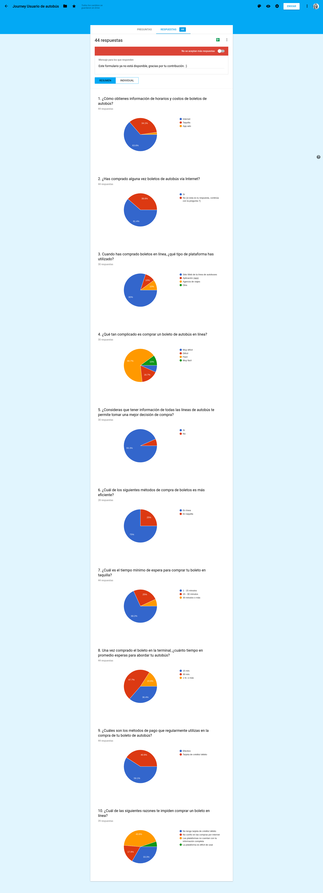
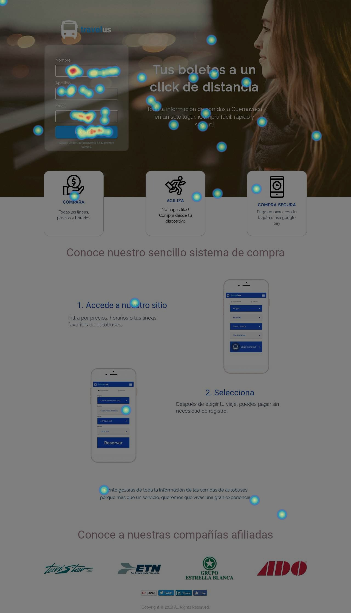
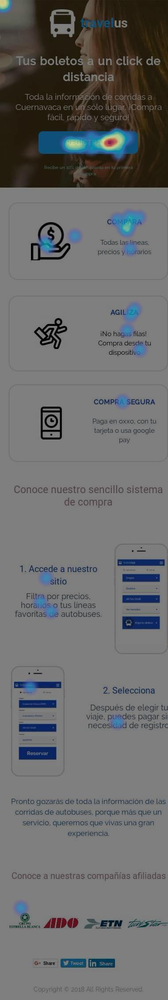
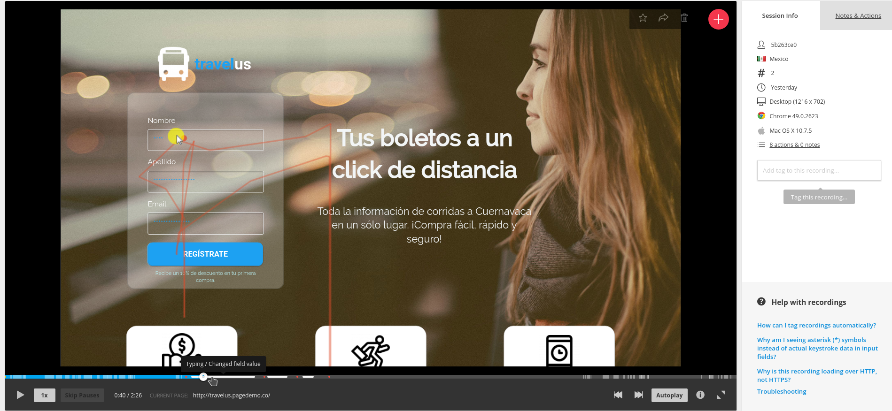
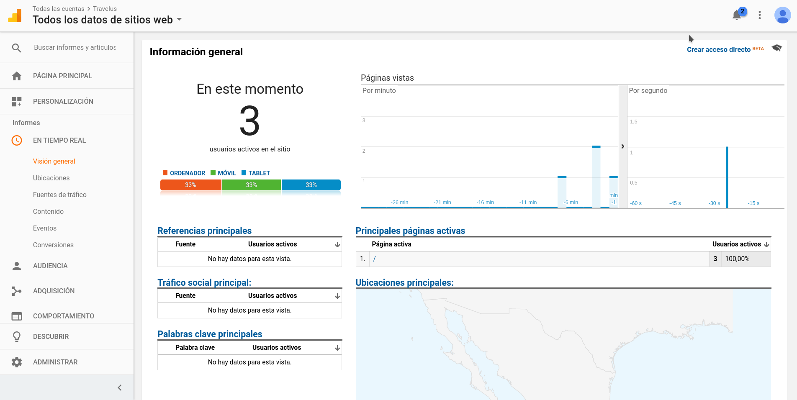
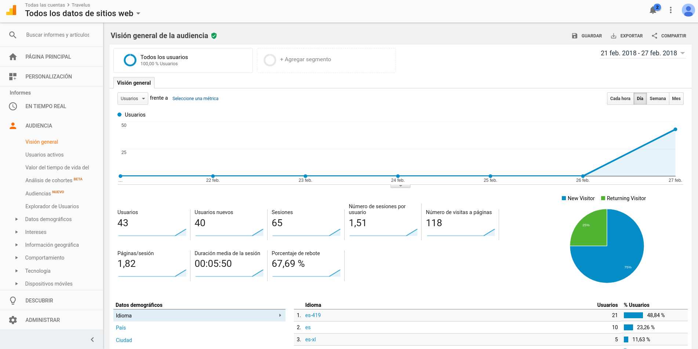
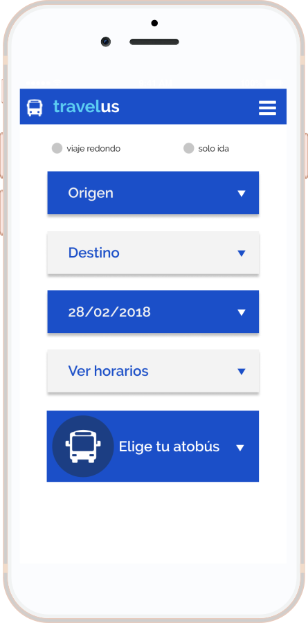
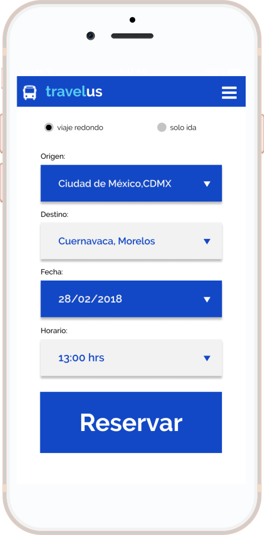

# Sprint 1 Introducción a UX

### Design thinking + UX Design + UX Research
#### Reto:
Entender y optimizar el journey de tomar un autobús de CDMX <> Cuernavaca.
#### Objetivo de proyecto:
Conocer todo el proceso de diseño de una solución tecnológica.

### Enunciado del problema:

- No existe una plataforma que reúna información acerca de todas las líneas de autobús con viajes entre Cuernavaca y Ciudad de México.

- El usuario no tiene acceso a la información centralizada de corridas de autobús entre Cuernavaca y CDMX, que le permita optimizar la compra de su boleto.

### Oportunidad de negocio
Optimizar el proceso de compra de boletos de autobús, eliminando el tiempo de espera e incertidumbre en la información que recibe el usuario, además de ofrecer   la oportunidad de realizar su compra en el momento y lugar que desea.

### Perfil de usuario
Adultos jóvenes de 18 a 40 años que estudian o trabajan en la CDMX, y necesitan agilizar el proceso de compra de un boleto de autobús para viajar a Cuernavaca.

### Touchpoints
1.- El usuario no tiene acceso a la información de corridas de cada línea de autobús.
2.- El usuario no tiene la posibilidad de adquirir un boleto en el momento y el lugar que quiere.
3.- El usuario debe acudir a una terminal para poder comprar el boleto y además experimentar la frustración de estar formado por un tiempo indeterminado.
4.- No tiene oportunidad de evaluar todas sus opciones y elegir la óptima respecto al costo del boleto, el horario de salida y la línea de autobús que desea utilizar.

### Objetivos de negocio
1.- Mejorar la experiencia de compra
2.- Evitar filas
3.- Brindar información certera al usuario en el momento de comprar sus tickets,  (horario, costo, duración del viaje, etc.)
4.- Mostrar toda la información en un sólo lugar
5.- Automatización en el proceso de venta y registro

### Encuesta
- Entender que es lo que valida la información.

1.- ¿Cómo obtienes información de horarios y costos de boletos de autobús?
    Internet / Taquilla / Otra

2.- ¿Alguna vez has comprado boletos de autobús por internet? Sí /No

3.- Si has comprado boletos en línea, ¿que tipo de plataforma has utilizado?
    Sitio web de la línea de autobuses / Aplicación (app) / otra

4.- ¿Que tan complicado ha sido comprar un boleto de autobus en línea? Fácil / Dificil / Muy Dificil

5.- ¿prefieres comprarlos en línea o directamente en la taquilla?

6.- ¿Cuánto tiempo debe esperar en la fila para comprar el boleto en taquilla? 1-15 min / 15-30 / 30-más

7.- Una vez que has comprado el boleto de  autobús en la terminal, ¿cuánto tiempo debes esperar para abordarlo?
    15 min. / 30 min. / 1 hora ++

8.- ¿Considera que tener información de las corridas de autobús por internet le permite tener una mejor desición de compra?

9.- ¿Cuales son los métodos de pago que regularmente utilizas para pagar el boleto de autobús?
    Efectivo / tarjeta de débito crédito / otros

10.- ¿Cuántas líneas de autobuses con destino a Cuernavaca conoces?

### Estrategia para encuestas (ux researcher)

##### Definir la herramienta de encuestas
Google forms
##### Segmentación de usuarios
Los participantes deben tener perfiles y características acordes con la audiencia potencial de la plataforma; 20 a 40 años.

#### Descripción de la Estrategia planteada
- Necesitamos llegar a nuestros usuarios donde quiera que estén a través de la web, por email, redes sociales.

- Asegurarnos que los encuestados comprenden las preguntas. Todas las respuestas son de opción múltiple, con el objetivo de cuantificar la información.

- Invitaciones personalizadas para incrementar la participación en encuestas online. La personalización produce un efecto positivo, induce a considerar que su opinión es importante para el investigador.

-La privacidad es otro aspecto a considerar cuando se usan invitaciones personalizadas, debemos mencionar que las respuestas son anónimas.

- Finalidad de la encuesta: Asegurarnos de aclarar que los motivos de la encuesta, tienen que ver con que reciba un mejor servicio y condiciones de compra.

- Duración aproximada, mencionar el tiempo aproximado para que el usuario determine si alcanza a completarla. “No te toma más de 5 minutos”

### Hotjar

##### Valor de Hotjar
- Nos permite realizar un análisis de heathmaps, permitiendo identificar las zonas de interés de forma visual.
- Genera recordings de la actividad de los usuarios, el tiempo que permanece en la página y permite el acceso a esos archivos.

##### Heatmap click desktop

##### Heatmap click phone

## Insights Hotjar
Datos:
- Heatmaps: 87 vistas en landing
- Recordings: 52 archivos
- Dispositivos: 10 vistas en iOS, 42 vistas en Android.

Insights:
- De los archivos recording que obtuvimos, 31 usuarios de Android derivaron en registro, de los usuarios de iOS de obtuvieron 8 registros.
- El promedio de navegación es de 00:02:45 minutos, tiempo suficiente para leer la información y completar el registro.
- En los archivos de Heatmaps, se observa el tráfico en el área del registro, así como la descripción del producto en los wireframes.
- El uso de herramientas visuales que muestren más información acerca del producto, crea mayor interés en el usuario, eso se vio reflejado en el número de movimientos dentro del landing.

### Google analytics
##### Valor de Analytics
- Permite los informes en tiempo real, como la ubicación del usuario.
- Se pueden generar informes personalizados, dependiendo de las especificidades del usuario.
- Se pueden tener informes como el seguimiento de nuestros usuarios.
- Resultados de las secciones por fuentes de tráfico.

#### Visión general

## Insights Analytics
Datos:
- Visión general de la audiencia
- Número de visitas de página: 118
- Porcentaje de rebote: 67%
- Duración media de la sesión: 00:05:50
- Datos demográficos: México 95.35%, Argentina 3.08%, Estados Unidos 1.54%
- Hora de mayor tráfico: 18:00 hrs.
- Dispositivos principales: Móviles 53.8%,  ordenadores 44.6%, tablets 1.5%
Insights:
- El 82.76% de nuestros usuarios utilizaron un dispositivo Android, frente a un 17.24% de usuarios de iOS.
- El 65% de las visitas desde android derivaron en el registro.

### Propuestas wireframes

### link de presentación Final
https://www.canva.com/design/DACwmuHqkf0/n3FqSmpC76poI3P3Chj-Zg/edit?layouts=&category=tACFar75J9E
